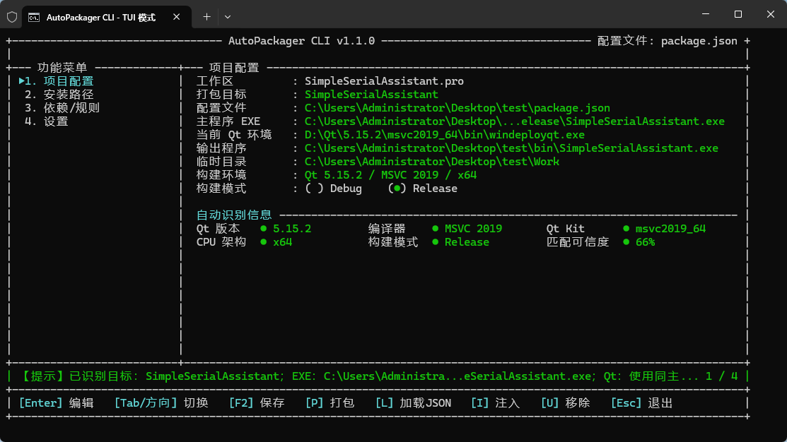
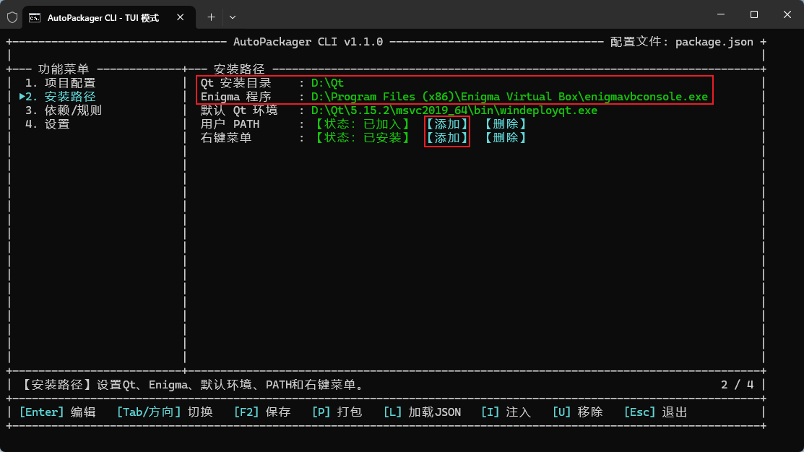

# AutoPackagerCLI

AutoPackagerCLI 是一款 Windows Qt 应用打包工具，可识别 qmake（`.pro`）和 CMake（`CMakeLists.txt`）项目，调用 `windeployqt` 收集运行依赖，并可通过 Enigma Virtual Box 封装为单个 EXE。



## 主要功能

- 自动识别项目、EXE、Debug/Release 和 Qt Kit。
- 支持 Qt 5/Qt 6、MinGW/MSVC、x86/x64 环境。
- 默认输出到项目根目录的 `bin` 文件夹。
- 支持 qmake SUBDIRS 和 CMake 多子项目。
- 支持构建完成后自动打包全部可执行目标。
- 支持 TUI、命令行、用户 `PATH` 和资源管理器右键菜单。

## 运行要求

- Windows 操作系统。
- 已安装项目使用的 Qt Kit，且 Kit 中包含 `windeployqt.exe`。
- 如需单文件打包，需安装 Enigma Virtual Box。
- 项目至少成功生成过一次目标 EXE。

## 首次设置

启动 `AutoPackagerCLI.exe`，进入“安装路径”页面：

1. 设置 Qt 安装根目录，例如 `D:\Qt`。
2. 设置 Enigma 程序，例如：

   ```text
   D:\Program Files (x86)\Enigma Virtual Box\enigmavbconsole.exe
   ```

3. 可将程序目录添加到用户 `PATH`。
4. 可添加资源管理器“在当前目录打开 AutoPackagerCLI”右键菜单。



全局安装路径会自动保存；`F2` 保存的是当前项目的 `package.json`。

## 快速打包

1. 使用 Qt Creator 构建一次项目。
2. 在项目根 `.pro` 或 `CMakeLists.txt` 所在目录启动 AutoPackagerCLI。
3. 检查主程序、当前 Qt 环境、构建模式和输出目录。
4. 按 `F2` 保存配置。
5. 按 `P` 开始打包。

输出目录默认为项目根目录下的 `bin`。


如果只打包一个现有 EXE，也可以在 EXE 所在目录启动程序，然后手动设置主程序路径。

## 构建后自动打包

完成项目识别后：

1. 选择需要自动打包的 Debug 或 Release 模式。
2. 按 `F2` 保存 `package.json`。
3. 按 `I` 注入自动打包命令。
4. Qt Creator 提示工程文件变化时选择重新加载。
5. 重新构建项目。

需要注意：

- 注入时选择 Debug，只在 Debug 目标重新链接后打包；选择 Release 同理。
- 切换 Debug/Release 后，需要重新按 `F2` 保存并按 `I` 注入。
- 相同模式下切换 Qt Kit，构建系统会传入本次实际生成的 EXE；启用 Qt 自动识别时，程序会根据该 EXE重新匹配 Qt 环境。
- 普通增量构建没有发生链接时不会触发打包；需要立即打包可按 `P`，或在 Qt Creator 中执行“重新构建”。
- 按 `U` 可以移除工作区全部自动打包注入，不会删除 `package.json` 和备份文件。

### 多子项目

在工作区根目录按一次 `I`，程序会向全部可执行子项目写入独立注入命令：

- 构建单个子项目，只打包该目标。
- 构建整个工作区，各 EXE 完成链接后分别打包。
- 静态库和动态库只作为依赖扫描，不会作为主程序打包。

工作区只使用一个根目录 `package.json`。公共打包开关保存一份，各 EXE 的输入、输出、工作目录、Kit 和依赖路径保存在各自的目标配置中。

## Qt 环境

| 设置 | 示例 | 作用 |
| --- | --- | --- |
| Qt 安装路径 | `D:\Qt` | 扫描已经安装的 Qt Kit。 |
| 默认 Qt 环境 | `D:\Qt\6.11.1\mingw_64\bin\windeployqt.exe` | 自动识别不足时使用的备用环境。 |
| 当前 Qt 环境 | 项目页显示的 `windeployqt.exe` | 本次打包实际使用的环境。 |

自动识别顺序：

1. 优先读取 EXE 构建路径中的 Qt Kit 信息。
2. 再读取 EXE 的 Qt 版本、CPU 架构和编译器类型。
3. 信息不足时选择兼容的默认环境。
4. 仍无法匹配时由用户手动选择。

Qt环境必须与 EXE 的 Qt 主版本、CPU 架构和编译器 ABI 一致，例如 MinGW 程序不能使用 MSVC Kit。

如果手动固定了“当前 Qt 环境”，程序不会自动切换到其他 Kit。切换 Kit 后依赖目录发生变化时，建议重新按 `F2` 保存并再次注入。

## TUI快捷键

| 快捷键 | 功能 |
| --- | --- |
| `Tab` / 方向键 | 切换页面或选项 |
| `Enter` | 进入设置或确认 |
| `F2` | 保存 `package.json` |
| `P` | 开始打包 |
| `L` | 加载当前目录 JSON |
| `I` | 注入全部可执行目标 |
| `U` | 移除全部注入 |
| `Esc` | 返回或退出 |

## 常用命令

```bat
AutoPackagerCLI.exe
AutoPackagerCLI.exe pack --config "D:\Project\package.json"
AutoPackagerCLI.exe validate --config "D:\Project\package.json"
AutoPackagerCLI.exe detect --main-exe "D:\Project\build\release\MyApp.exe"

AutoPackagerCLI.exe env list
AutoPackagerCLI.exe env set --index 1

AutoPackagerCLI.exe inject --project-file "D:\Project\MyWorkspace.pro" --all-targets --build-mode Release
AutoPackagerCLI.exe uninject --project-file "D:\Project\MyWorkspace.pro" --all-targets
```

只处理一个子目标时使用 `--target`：

```bat
AutoPackagerCLI.exe inject --project-file "D:\Project\MyWorkspace.pro" --target MyApp --build-mode Debug
AutoPackagerCLI.exe uninject --project-file "D:\Project\MyWorkspace.pro" --target MyApp
```

路径包含空格时，必须使用英文双引号包围完整路径。

## 使用注意事项

- 自动打包只在目标成功链接后执行，编译或链接失败不会生成打包结果。
- 修改 `package.json` 后，应核对主程序、输出目录、构建模式和当前 Qt 环境。
- Debug目录存在 EXE却未识别时，请确认 EXE名称与项目 `TARGET` 或 CMake目标名称一致。
- 切换 Debug/Release 后必须重新保存并注入。
- CMake注入目前主要面向使用 `CMAKE_BUILD_TYPE` 的单配置构建目录；Visual Studio 等多配置生成器需要核对实际触发结果。
- 当前版本仅支持 Windows。
