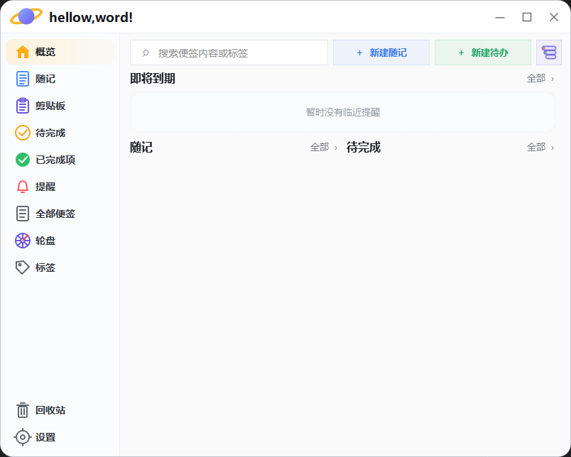
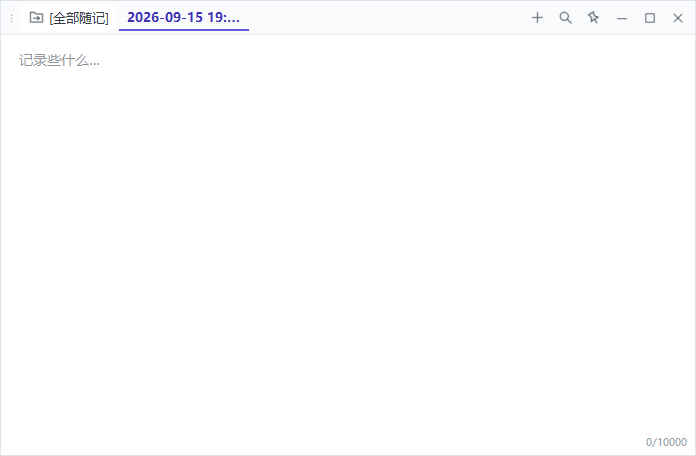
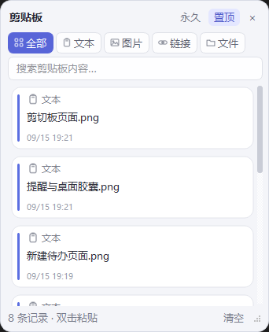
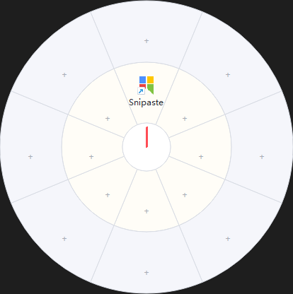

# OrbitNotes

OrbitNotes 是一款 Windows 本地随记与待办工具，集成桌面提醒胶囊、剪切板历史、标签和快捷轮盘。数据默认保存在程序旁的 `data` 文件夹，不提供云同步。

## 快速开始

### 随记

点击“新建随记”创建内容。随记支持分组、自动保存、查找替换和独立窗口；独立窗口的位置与大小会自动记忆。

### 待办

点击“新建待办”，输入任务内容并设置标签、优先级、结束时间、提前提醒和重复规则。正文中输入 `#标签名` 后按空格，可以快速添加标签。

普通待办使用圆圈图标，重要待办使用闪电图标。重复任务支持每天、每周、自定义周几、每月和每年。

### 提醒与桌面胶囊

待办可显示为桌面胶囊。胶囊支持靠边收起、批量显示或隐藏、完成任务和延后提醒。背景色按日期区分：

- 今天或已过期：粉红渐变
- 明天：蓝色渐变
- 后天及以后：绿色渐变

### 剪切板

剪切板支持文本、图片、链接和文件历史，可搜索、筛选、置顶、删除及双击粘贴。图片仅常驻缩略图，完整图片按需读取。

### 快捷轮盘

按住鼠标中键并移动可选择轮盘项目，松开后执行。轮盘项目可以启动程序、打开随记组或执行 CMD 命令；触发时间和移动阈值可在设置中调整。

### 标签与回收站

标签支持新建、改名、改色、删除和多标签筛选。随记和待办可单条或批量移入回收站；回收站支持还原和永久删除。

## 常用设置

设置页面可调整开机启动、静默启动、关闭到托盘、提醒默认值、随记字符上限、剪切板保留时间、轮盘参数和全局快捷键。

## 默认全局快捷键

| 快捷键 | 功能 |
| --- | --- |
| `Ctrl+Alt+M` | 打开随记独立窗口 |
| `Ctrl+Alt+D` | 新建待办 |
| `Ctrl+Alt+V` | 打开剪切板悬浮窗 |

全局快捷键可以在设置中修改、关闭和检查占用。

## 数据与迁移

程序数据保存在可执行文件旁的 `data` 文件夹。迁移软件时，请复制完整程序目录，不要只复制单个 JSON 文件。

## 使用注意事项

- 提醒功能需要程序保持运行，系统唤醒后会自动补查。
- 程序目录需要具备写入权限。
- 永久删除和清空剪切板后无法在软件内恢复。
- 界面图片需要放入 `docs/images` 目录，并使用文档中标注的中文文件名。
