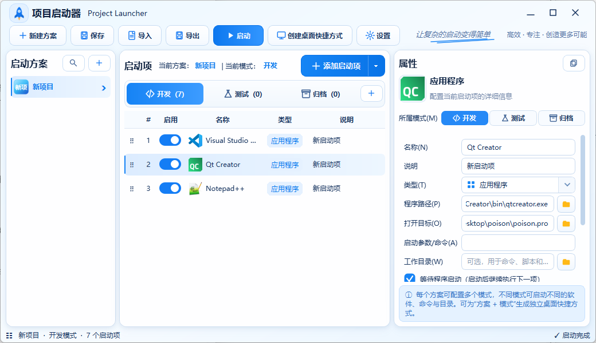

# Project Launcher（项目启动器）

ProjectLauncher 是一款基于 Qt Widgets 的 Windows 项目工作环境启动器。它将开发环境组织为“启动方案 → 模式 → 启动项”，可以按照设定顺序启动编辑器、调试工具、命令、脚本、文件夹和网页，适合需要一键恢复多个项目工作现场的场景。

 

## 主要功能

- 使用启动方案集中管理不同项目，每个方案可包含开发、测试、归档等多个模式。
- 支持应用程序、CMD、PowerShell、文件、文件夹、URL 和延时七种启动项。
- 启动项支持启用/禁用、复制、删除、拖拽排序、跨模式分配和单项运行。
- 按列表顺序异步执行，界面不会因等待程序启动或结束而阻塞。
- 支持启动前延时、启动后延时、等待启动、等待结束、管理员运行和已运行时跳过。
- 应用程序路径、打开目标、启动参数和工作目录相互独立，不区分 VS Code、Qt Creator、Keil 等软件类型。
- 选择应用程序或 Windows 快捷方式时，可自动同步程序名称及高清原始图标。
- 项目目录可作为 `${PROJECT_DIR}` 的统一路径基准，用于程序路径、目标、参数和工作目录。
- 可为“启动方案 + 模式”创建桌面快捷方式，通过快捷方式直接执行指定工作流。
- 提供置顶的单行进度卡片，只显示当前启动项和整体完成进度。
- 内置完全离线的项目图标生成器，支持名称缩写、关键词识别、图形预设、自定义图片及 PNG/ICO 导出。
- 支持项目配置导入、导出和分项目保存，并保留最近一次及历史运行日志。

## 核心概念

| 层级 | 作用 | 示例 |
| --- | --- | --- |
| 启动方案 | 表示一个项目或一套工作环境 | 项目启动器、嵌入式项目、测试环境 |
| 模式 | 表示同一项目的不同启动组合 | 开发、测试、归档 |
| 启动项 | 表示需要依次执行的具体动作 | 启动 VS Code、执行脚本、打开项目目录 |

一个启动项可以分配给多个模式。相同启动项在不同模式中共享配置，修改后会同步更新。

## 支持的启动项

| 类型 | 主要配置 | 用途 |
| --- | --- | --- |
| 应用程序 | 程序路径、打开目标、启动参数、工作目录 | 启动任意 EXE、BAT、CMD 或快捷方式目标 |
| CMD | 命令内容、工作目录、执行后保持窗口 | 执行批处理和命令行工具 |
| PowerShell | 命令内容、工作目录 | 执行 PowerShell 命令或脚本 |
| 文件 | 打开目标 | 使用系统默认程序打开文件 |
| 文件夹 | 打开目标 | 打开资源管理器目录 |
| URL | 打开目标 | 使用默认浏览器打开网页 |
| 延时 | 延时时间 | 在启动流程中插入等待步骤 |

普通启动项默认在执行完成后等待 `1000 ms` 再继续下一项。可在属性栏中为每一项单独调整；纯延时启动项只使用自身的“延时时间”。

## 快速开始

1. 点击顶部“新建方案”。
2. 输入方案名称，并按需设置项目目录。
3. 选择自动匹配、文字缩写或关键词图形作为项目图标，也可以选择自定义图片。
4. 在开发、测试或归档模式中点击“添加启动项”。
5. 设置程序路径、打开目标、参数、工作目录和等待方式。
6. 拖动启动项调整执行顺序，使用模式按钮决定该启动项属于哪些模式。
7. 点击“保存”写入配置，然后点击“启动”执行当前模式。

如需从桌面直接启动当前工作流，选中目标方案和模式后点击“创建桌面快捷方式”。

## 应用程序配置

应用程序类型不绑定具体 IDE。程序将“要运行的软件”和“交给软件打开的内容”分开处理：

| 设置 | 说明 |
| --- | --- |
| 程序路径 | 实际启动的程序、命令文件或 Windows 快捷方式 |
| 打开目标 | 追加到启动参数末尾的文件或目录，可留空 |
| 启动参数 | 传递给程序的额外命令行参数 |
| 工作目录 | 可选的进程工作目录，主要用于命令、脚本和相对路径 |

选择 `.lnk` 后，程序会读取其真实目标、参数、工作目录和原始图标。启动时使用真实目标，界面显示不带快捷方式箭头的应用图标。

## 项目目录与路径变量

每个方案可设置一个项目目录。配置中的以下字段可以使用 `${PROJECT_DIR}`：

```text
程序路径：${PROJECT_DIR}\tools\MyTool.exe
打开目标：${PROJECT_DIR}\workspace
启动参数：--config "${PROJECT_DIR}\config.json"
工作目录：${PROJECT_DIR}
```

执行启动项前，`${PROJECT_DIR}` 会展开为当前方案保存的项目目录。

## 执行与提示窗口

- 仅执行当前模式中已启用的启动项，并始终按照列表顺序推进。
- 单个启动项失败后会记录错误并继续执行后续项目。
- “等待程序启动”会在系统确认进程启动后继续下一项。
- “等待程序结束”会等待进程退出，并根据退出码记录成功或失败。
- CMD 可选择执行完成后保留命令窗口。
- 管理员运行会触发 Windows UAC；等待结束时会持续跟踪管理员进程状态。
- 主界面启动完成后只关闭提示卡片，不关闭主窗口。
- 桌面快捷方式启动成功后，提示卡片显示 3 秒并渐隐退出；失败时保留窗口，点击后渐隐退出。

## 项目图标

自动项目图标完全在本地生成，相同名称、配色和图形设置会得到一致结果。新建方案时可选择：

- 自动匹配或文字缩写。
- 通用项目、Qt、芯片、终端、波形、数据库、代码、AI、云平台、相机、安全盾牌、工具等图形。
- 自定义 ICO、PNG、JPG、JPEG 或 BMP 图片。

项目右键菜单可以继续换配色、修改关键词图形、恢复自动生成或导出 PNG/ICO。每个项目仅保留一个当前自动图标缓存。

## 配置与日志

所有运行数据位于程序目录，便于便携使用和备份：

```text
config/
├── settings.json
└── projects/
    └── 项目名称__project_xxxxxxxxxxxx.json

logs/
├── last-run.log
└── run-YYYYMMDD-HHmmss-zzz.log

cache/
└── icons/
```

- `settings.json` 保存最近选择的方案和模式。
- 每个方案使用独立且可读名称的 JSON 文件保存。
- `last-run.log` 保存最近一次执行日志，历史日志最多保留 99 份。
- 项目配置可以从顶部工具栏导入或导出。

## 使用注意事项

- 当前版本主要面向 Windows，快捷方式、UAC 和原生图标读取功能仅在 Windows 生效。
- 删除方案后，需要点击“保存”才会删除对应项目配置文件和图标缓存。
- 手动移动或删除应用快捷方式后，其图标可能回退为程序图标或通用应用图标。
- 工作目录是高级可选项；普通应用通常可以留空，依赖相对路径的命令和脚本应正确设置。
- 项目目录只提供统一路径基准，不会自动扫描、构建或修改项目内容。

